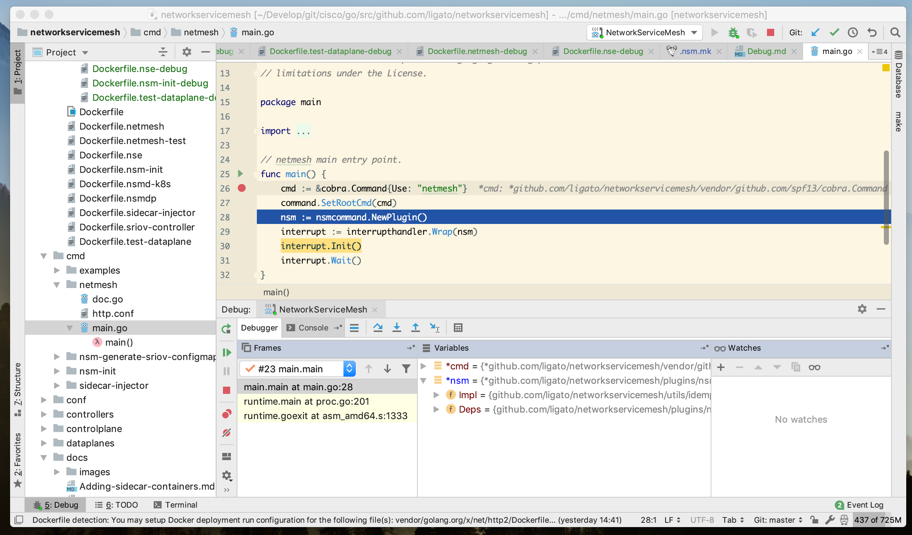

A short guide to debug Go code inside Kubernetes. 

Debug is done using [Delve](http://github.com/derekparker/delve)

# One node debug

One node debug is done inside one Docker container with files synchronized with docker env.
 
## Developer environment docker image

`make docker-devenv-build` - build a docker dev environment container image.

This container is used to build DLV and have all necessary dependencies + have file synchronized via volume to a 
current directory, so NSM sources are required.

It builds a ./docker/debug/Dockerfile.debug and produces *networkservicemesh/devenv* image.

## Running a dev container to host apps

After base image is build, it could be used to start one or more debug containers.
Right now for single-node experience it would be good to have one container, this container forward ports 40000-40100 
to local host.

`make docker-devenv-run` -  it will bring container up dev container and allow us to start one or more apps 

applications under debug and have a local connection with IDE.

After docker images is started it execute ./scripts/debug_env.sh script to setup all required dependencies, 
check for deps and call go generate to generate all required code. 

We will receive following output:
<pre>
user /go/src/github.com/ligato/networkservicemesh $ make docker-devenv-run
Starting NSC DevEnv dummy application

********************************************************************************
          Welcome to NetworkServiceMesh Dev/Debug environment                   
********************************************************************************

Call dep ensure
Install openapi-gen
Install deepcopy-gen
Run generators
Generating deepcopy funcs
Generating clientset for networkservice:v1 at github.com/ligato/networkservicemesh/k8s/pkg/networkservice/clientset
Generating listers for networkservice:v1 at github.com/ligato/networkservicemesh/k8s/pkg/networkservice/listers
Generating informers for networkservice:v1 at github.com/ligato/networkservicemesh/k8s/pkg/networkservice/informers
Initialisation done... 
Please use docker run debug.sh app to attach and start debug for particular application
#You could do Ctrl+C to detach from this log.
</pre>

Container is executed in detached mode, and logs are tailed, so after it is complete we could Ctrl+C to detach from logs.

### Useful script ./scripts/debug.sh 

It allows to start one of components in *debug* mode, since codebase is synchronized every call will compile 
actual code so every restart will start a last code into debug. 

## Debug components

Alternative to debug.sh script, we could do same *running* command from host system using  

`make docker-X-debug` - so it will connect to docker image and execute `debug.sh X` so it will start debugging of particular component.

Example output are following:
<pre>
$ make docker-debug-nsc
Compile and start debug of ./examples/cmd/nsc/nsc.go at port 40001
</pre> 

So we could connect via remote debugger to local port 40001. 

Examples:
* `make docker-debug-nsmd` - debug *controlplane/cmd/nsmd*
* `make docker-debug-nsc` - debug *examples/cmd/nsc*
* `make docker-debug-icmp-responder-nse` - debug *examples/cmd/icmp-responder-nse*

## Stoping debug container

Use `make docker-devenv-kill` to stop debug container.

# Debug in Kubernetes

## Steps

Since devenv require sources to be mapped, vagrant is modified to map sources into containers and into docker containers.

1. Build a devenv image using `make docker-devenv-build`
2. Startup vagrant and load images inside it. 
    1. `make vagrant-start`
    2. `make docker-devenv-save` - save image
    3. `make vagrant-devenv-load-images` - load image into docker
3. Modify/Copy config in k8s/conf/ for app and add volumes for 'sources' and change image to 'networkservicemesh/devenv'
    k8s/conf/debug/nsmd-debug.yaml could be used as example.
4. If app was deployed to kubernetes, please delete appropriate config. And apply config with debug image.
5. In first terminal we could attach to container and start debug.  
    `make k8s-nsmd-debug` will execute debug.sh inside container and will print port to attach. So
6. In second terminal we need to proxy port `make k8s-nsmd-forward port=40000` to forward a port from container, Please refer to scripts/debug.sh for ports.
7. Attach to local port from IDE.
 

Step 5 could be repeaded, since code are in sync, no need to redeploy any other components.
 
## IDEs

Few IDEs are support Delve

### Visual Studio Code
TODO:

### Goland IDE

1. Go to menu: `Run -> Debug -> Edit configurations...` and add `Go Remote`.
2. In dialog specify port `40000` as debug target and host `localhost` since we will forward a port.
    
3. Click debug and we ready.

